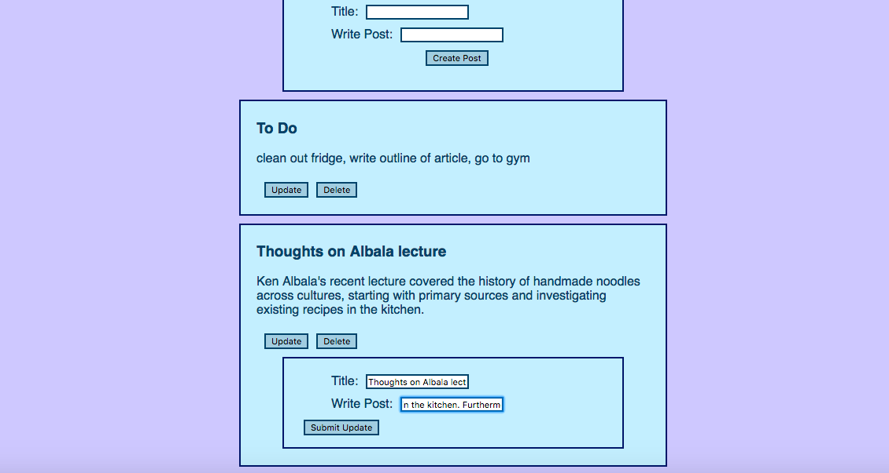
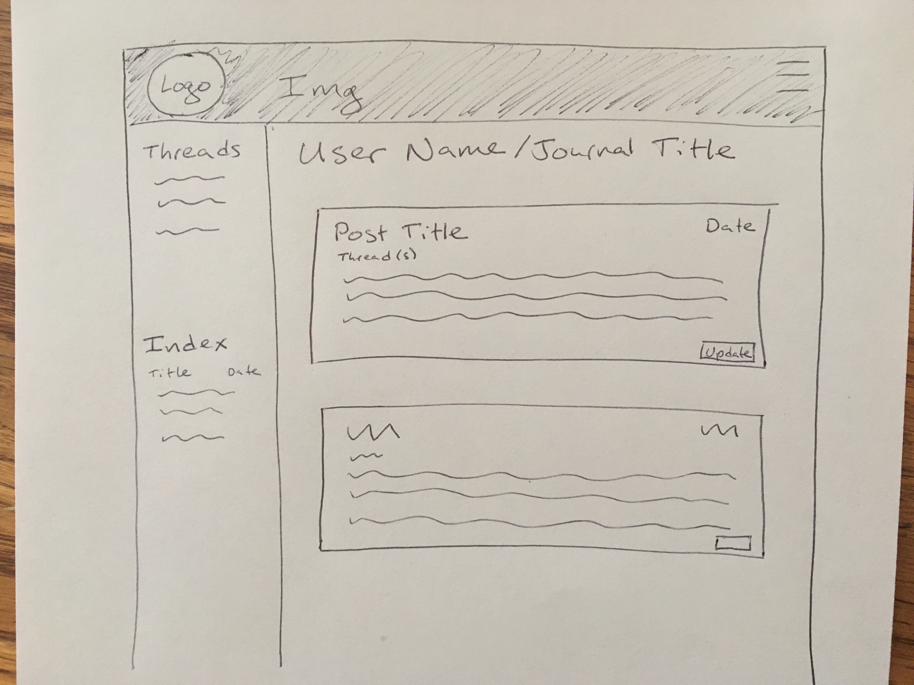

Journal App Client

Check out the API [here](https://github.com/eabrigham/journal-api)

A front end for a digital notebook/bullet journal where a user can write posts on a variety of topics. Implemented with Javascript and React.

This app was a chance to learn React, including some of the patterns around storing state and passing props down to child components. 

Install dependencies using npm install. Run this program locally using 'PORT=7165 npm start' in conjunction with the back-end repo.

Planning & Documentation:

[Description of how program is structured](walkthrough.md)

User Stories
A user can…
* log in/out
* use the website on a computer or a phone
* create a name for the journal
* write a post
* read their own past posts
* title a post

In a future version, I plan to add labels which a user can tag their posts with, and then display only those posts with a particular label.

